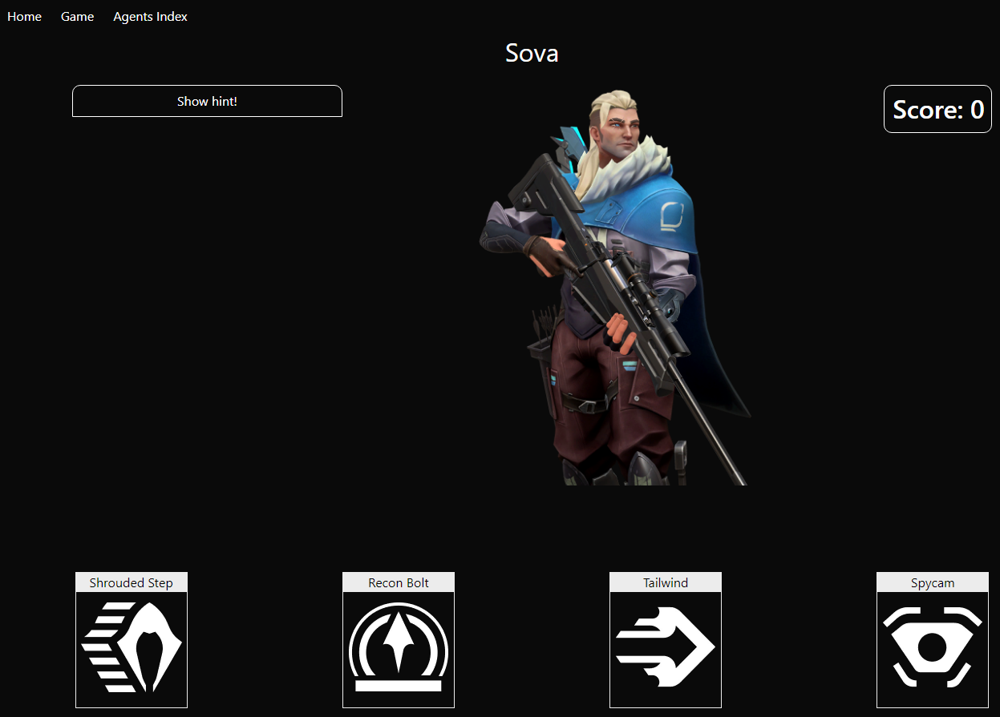
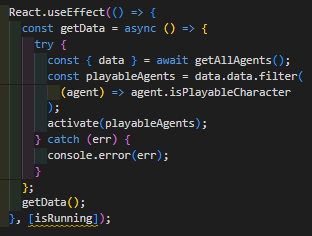
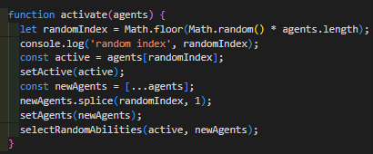
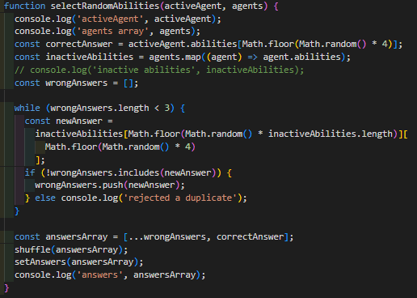
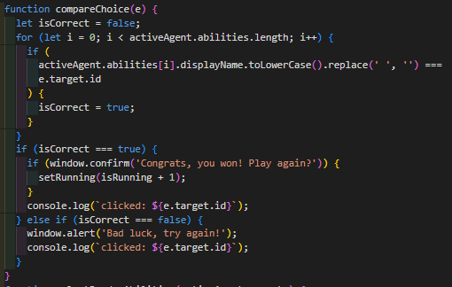

# Project 1 - 'Valorant Guessing Game'

Valorant Guessing Game is a frontend application based on characters and abilities from the video game **Valorant**. It displays a character from the game and four different abilities. The player has to pick the ability they believe belongs to the character displayed on screen. I made this as my second project for the General Assembly Software Engineering Immersive course, collaborating with **[Jordan Smyth](https://github.com/jsmyth1423/)**. This was my first experience building a project with **React.js**.

**Technologies Used** - HTML, CSS, Javascript, React.js, Axios, Bulma, SASS, Postman, Node.js, Netlify

**Duration** - 2 days

**[Link](https://project-2-api.netlify.app/)**

## The Brief

- Consume a public API
- Have several components
- The app can have a router
- Be deployed online

## App Overview

The screenshot below shows the main game page.

At the top of the screen is the navbar that links to the home page and the 'Agents Index', a page that allows you to learn more about the characters of the game. On the left side there is a button to click to show the description of the character, if the player needs a hint.

## Technical Overview

In order to make the game function the way we had envisaged in our planning stage, we had to poll the Valorant API to retrieve a full list of characters in the game (called 'Agents') and all the information associated with that character, including abilities. Once that data was retrieved using **Axios**, we had to do the following.

1. Filter out one character, an unplayable duplicate version of one of the other characters.

2. Randomly select one character to be the 'Active Agent', and remove that agent from the main list of Agents

3. Select one of the Active Agent's abilities, select three random abilities from the list of other agents without any duplicates, then shuffle the order of the abilities.

Once these are all done, the character and selected abilities are displayed on the page. The user can select one of the 4 displayed abilities by clicking on it. When they do, the game determines whether or not the answer was correct then displays a message telling the result. If the user selected the correct answer, the score increments and the game resets.

## Design Notes

The app's styling uses Bulma as a base, with some custom CSS written in certain places. I'm quite happy with how clean the design of each page is, especially considering the limited timescale we had to work on the project.

## Known bugs, other issues, and scope for improvement

As far as I'm aware there are no bugs that prevent the app from working as intended. If we had more time to work on the project, we would have implemented a few more features such as a hard mode.

## Wins and Key Learnings

The biggest win for me in this project was gaining a much firmer understanding how to properly respect state. There were multiple challenges along the way with regards to setting and using state (especially when dealing with multiple pieces of state that are reliant on eachother), but by the end Jordan and I were very confident with our use of `useEffect` and `useState`, to the point that we were able to add a new piece of state at the last minute to track the player score.